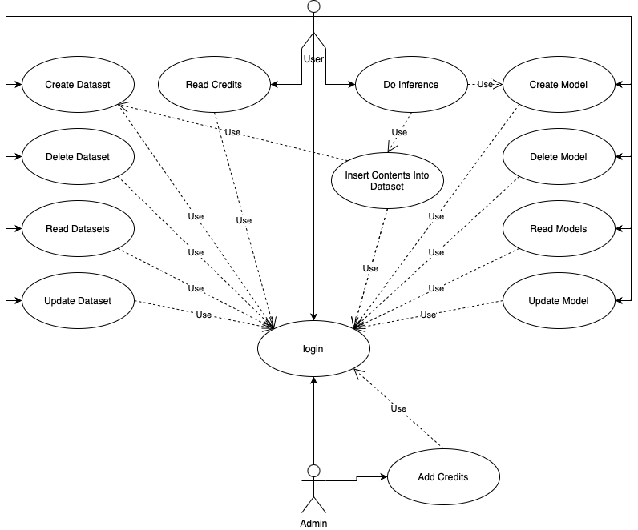
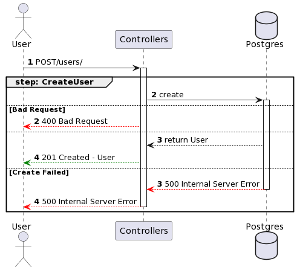
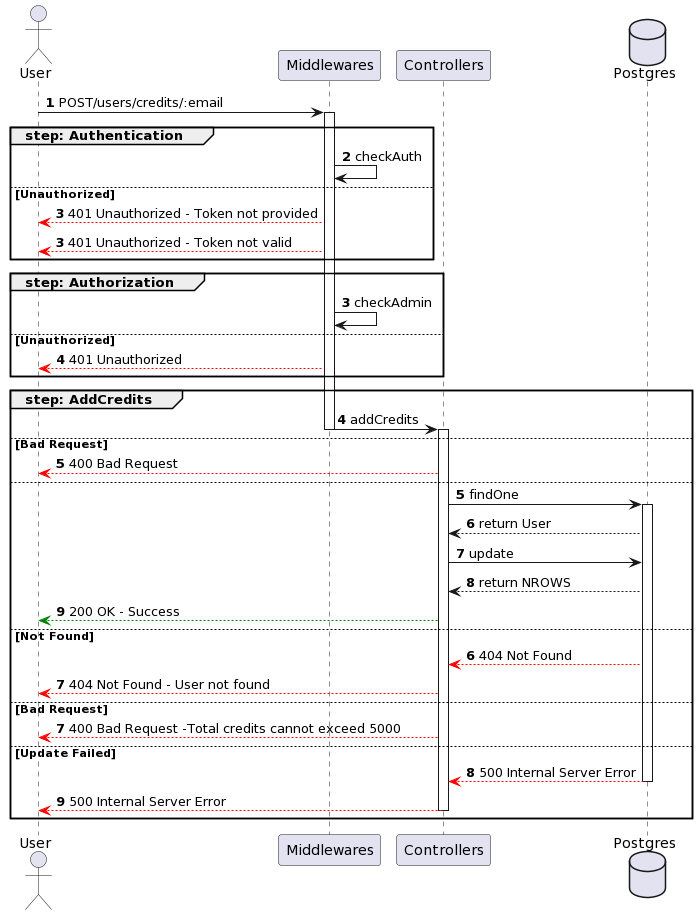
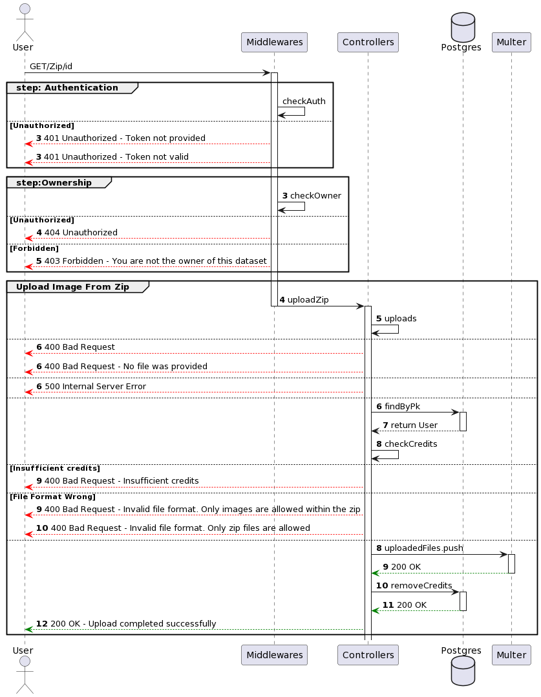
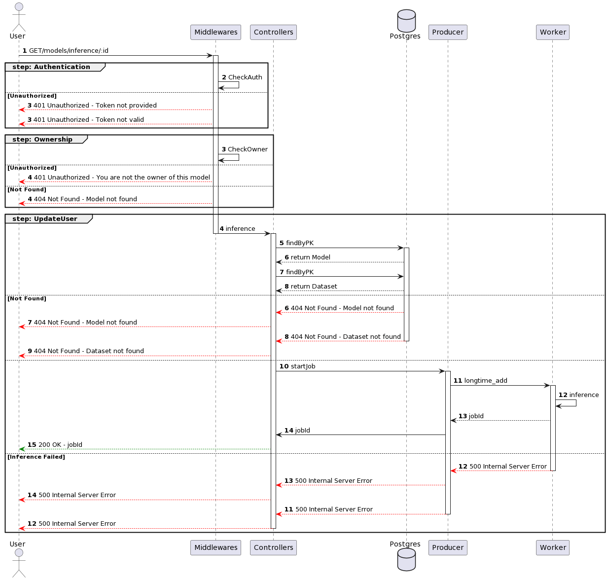
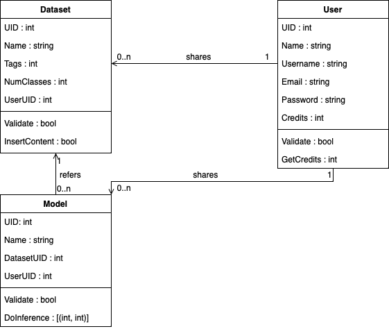

# PixelHub
PixelHub è un hub di modelli e dataset per la computer vision, che offre risorse per lo sviluppo e l'implementazione di algoritmi e applicazioni visive avanzate.

## Indice
- [Obiettivo](#obiettivo)
- [Progettazione](#progettazione)
  - [Diagrammi UML](#diagrammi-uml)
  - [Descrizione dei Pattern](#descrizione-dei-pattern)
- [Avvio del Progetto](#avvio-del-progetto)
  - [Utilizzo di Docker Compose](#utilizzo-di-docker-compose)
  - [Test del Progetto](#test-del-progetto)

## Obiettivo
L'obiettivo di questo progetto consiste nello sviluppo del backend di un portale che offre funzionalità avanzate per la gestione e l'elaborazione di dataset e modelli neurali. Il portale è accessibile agli utenti registrati e consente loro di caricare i propri dataset, che possono includere un insieme di dati come immagini o video. Inoltre, gli utenti possono anche caricare i propri modelli neurali, che rappresentano reti neurali pre-addestrate.

Una volta caricati i dataset e i modelli, il sistema offre la possibilità di effettuare inferenze su di essi. Questo processo di inferenza può richiedere un tempo di elaborazione maggiore rispetto alle richieste standard, poiché comporta l'applicazione dei modelli neurali ai dati presenti nei dataset.

L'obiettivo è quindi fornire un ambiente sicuro e scalabile in cui gli utenti possano gestire i propri dataset e modelli, eseguire inferenze e monitorare i task che richiedono tempi di elaborazione più lunghi. Si presta particolare attenzione all'ottimizzazione delle prestazioni e all'efficienza dell'elaborazione, al fine di garantire un'esperienza fluida e responsiva agli utenti durante l'utilizzo del portale.

Il risultato finale è un backend funzionale, affidabile e scalabile che consente agli utenti registrati di gestire i propri dataset e modelli neurali, eseguire inferenze e monitorare i task di elaborazione più complessi, fornendo al contempo una piattaforma sicura e performante per le operazioni di elaborazione dei dati.

## Progettazione
### Diagrammi
In questa sezione sono presenti i diagrammi UML che illustrano la progettazione del progetto.

#### Diagramma dei Casi d'Uso
Come possiamo vedere dalla foto sottostante, abbiamo rappresentato, i casi d'uso e quindi le funzionalità a cui le tipologie di utente potranno accedere. 

#### Diagrammi delle Sequenze
Con i diagrammi delle sequenze, siamo andati a rappresentare, come l'utente muovendosi su una singola rotta, vada in realtà ad azionare vari meccanismi sottostanti, possiamo vederne alcuni esempi nelle foto sottostanti




e i restanti nella cartella [Diagrammi](./images/Sequence)

#### Diagramma delle classi
Nell'immagine sottostante, abbiamo rappresentato le classi che abbiamo utilizzato nel progetto.


### Descrizione dei Pattern
Il progetto utilizza diversi pattern di progettazione per ottenere un'elaborazione in background efficiente e scalabile. Vengono utilizzati i seguenti pattern:
- MVC(Model-View-Controller) 
- Pattern 

## Avvio del Progetto
Per eseguire il progetto, è possibile utilizzare Docker Compose per configurare facilmente i servizi necessari.

### Utilizzo di Docker Compose
1. Installa Docker e Docker Compose, se non l'hai già fatto.
2. Clona questo repository sul tuo computer locale.
3. Apri un terminale e naviga fino alla directory del progetto.
4. Esegui il seguente comando per avviare i servizi:

```bash
docker-compose up --build
```

Questo comando avvierà i servizi specificati nel Docker Compose, compreso il server RabbitMQ, l'applicazione Flask, il server Node e PostgreSQL.

5. L'applicazione sarà accessibile all'indirizzo `http://localhost:3001`.

### Importazione delle Rotte da Postman

Se desideri utilizzare le rotte definite in Postman nel tuo progetto, puoi seguire i seguenti passaggi:

1. Assicurati di avere Postman installato sul tuo sistema. Puoi scaricarlo da https://www.postman.com/downloads/.

2. Scarica il file di collezione delle API dal repository. Puoi trovarlo nella cartella "postman".

3. Apri Postman e fai clic sul pulsante "Import" nell'angolo in alto a sinistra.

4. Seleziona l'opzione "Import From File" e carica il file di collezione delle API scaricato.

5. Una volta importato il file, dovresti vedere tutte le rotte e le relative configurazioni in Postman.

6. Puoi testare le rotte direttamente in Postman per confermarne il funzionamento.

## Utilizzo ottimale del Sistema


